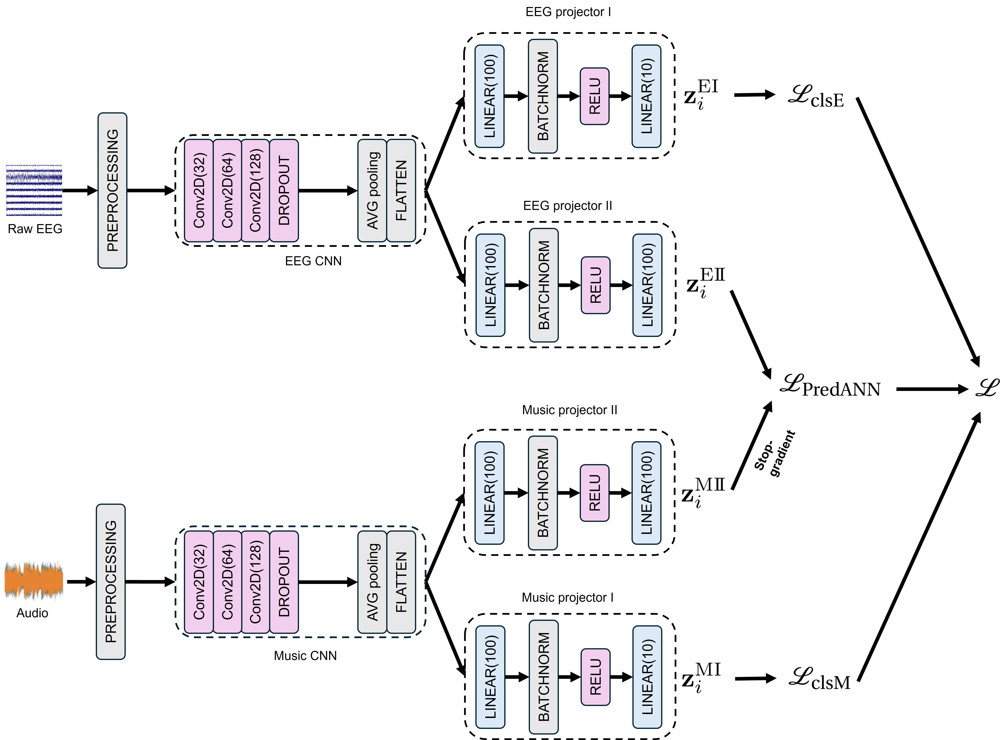

# Predicting Artificial Neural Network Representations to Learn Recognition Model for Music Identification from Brain Recordings

## Neural Network Architecture
Two separate 2D CNNs are employed to process music and EEG data independently. The outputs include individual losses for music and EEG, along with a contrastive loss for learning the relationship between the two modalities.
 

## How to run codes
### Steps to Execute Experiments
#### For 3s experiment
1. **Navigate to the appropriate folder**  
   - For a **3-second experiment**, go to the **`codes_3s`** directory.
2. **Run the experiment**  
Execute the experiment script in the terminal using the following command:
```bash
   nohup sh sequential_3s.sh > log/log.txt &
```
   - Output logs are saved to **`log/log.txt`**.
3. **Monitor the experiment's progress**  
You can monitor the experiment's progress by checking the log file  
   - The log file contains real-time outputs.
4. **Verification of results**  
The experimental outcomes can be validated by examining the trained model saved under **`codes_3s/run`**.  
   - The generated checkpoint files are stored in this directory and can be utilized for subsequent 7s experiments.  
   - To customize the checkpoint naming convention, modify the **`training_date`** parameter within the script **`sequential_3s.sh`**.  

#### For 7s experiment
1. **Navigate to the appropriate folder**  
   - For a **7-second experiment**, go to the **`codes_7s`** directory.
2. **Specify the Evaluation Method**  
   The evaluation method can be set in the file  
   **`codes_7s/predann/modules/_init_.py`**.
   - Locate **line 2** in **`__init__.py`**:
```python
   from .evaluation_mean_7s import EEGContrastiveLearning
```
   - To use a different evaluation method, replace **`.evaluation_mean_7s`** with one of the following:
      - **`.evaluation_max_7s`** 
      - **`.evaluation_majority_7s`**.
3. **Load the checkpoint**  
To resume evaluation, specify the **checkpoint path** in the evaluation script.  
   - Open **`codes_7s\main_checkpoint.py`**
   - Update the following lines:
      - **Line 125**
         ```python
            resume_from_checkpoint="checkpoint_example.ckpt"
         ```
      - **Line 129**
         ```python
            checkpoint_path = "checkpoint_example.ckpt"
         ```
   - We provide an example checkpoint (**`checkpoint_example.ckpt`**) for demonstration purposes. It is untrained. Replace it with your trained checkpoint. 
4. **Run the experiment**
Execute the experiment script in the terminal using the following command:
```bash
   nohup sh sequential_7s.sh > log/log.txt &
```
   - Output logs are saved to **`log/log.txt`**.
5. **Monitor the experiment's progress**
You can monitor the experiment's progress by checking the log file
   - The log file contains real-time outputs.

### Dataset Path Configuration
To ensure successful execution, configure the dataset paths to match your local environment.
- **Modify Dataset Path**
  Update the dataset path in the following preprocessing scripts:
   - **`preprocessing_eegmusic_dataset_3s.py`**
   - **`preprocessing_eegmusic_dataset_7s.py`**.
   - The **`Preprocessing_EEGMusic`** class loads the dataset using **`_base_dir`**.  
     In our example, the path is set as:
      ```python
         _base_dir = "/workdir/share/NMED/NMED-T/NMED-T_dataset" 
      ```
   - Sequential scripts (**`sequential_3s.sh`** and **`sequential_7s.sh`**) are provided for executing experiments.  
     These scripts include the necessary parameters for their respective experiments.

### Important Notes
- Ensure that the dataset is preprocessed **before** running experiments.
- Verify the checkpoint paths are correctly specified in the evaluation scripts. Incorrect paths will lead to runtime errors.
- To maintain consistency with the experimental design, the evaluation segment length **must not exceed 8 seconds**.
- The provided Sequential scripts (**`sequential_3s.sh`** and **`sequential_7s.sh`**) are pre-configured with default parameters.  
  Users may adjust these parameters according to their specific experimental requirements.

## Code Structure and Files
### Code Structure for 3-Second Training and Evaluation
```
predann/
├── datasets/                      
│   ├── __init__.py                # Initialization file for the datasets module for 3s experiments
│   ├── dataset.py                 # Base class for datasets
│   └── preprocessing_eegmusic_dataset_3s.py # Preprocessing script for EEG and music data (3-second segments)
│
├── models/                        
│   ├── __init__.py                # Initialization file for the models module
│   ├── model.py                   # Base class for model definitions
│   └── sample_cnn2d_eeg.py        # Implementation of a 2D CNN model for EEG data
│
├── modules/                       
│   ├── __init__.py                # Initialization file for the modules in 3s experiments
│   ├── clip_loss.py               # Implementation of the Clip Loss function
│   └── contrastive_learning_3s.py # Script for contrastive learning using 3-second segments
│
├── utils/                         
│   ├── __init__.py                # Initialization file for the utilities module
│   ├── checkpoint.py              # Utility script for saving and loading model checkpoints
│   └── yaml_config_hook.py        # Utility script for loading YAML configuration files

config/                        
└── config.yaml                # Main configuration file for the project

log/                           
└── log.txt                    # Log file for recording training and evaluation progress

main_3s.py                     # Main script for training and evaluating 3-second segments
requirements.txt               # Required Python packages   
sequential_3s.sh               # Script for running the 3s experiments
```
### Code Structure for 7-Second Evaluation
```
predann/
├── datasets/                      
│   ├── __init__.py                # Initialization file for the datasets module for 7s experiments
│   ├── dataset.py                 
│   └── preprocessing_eegmusic_dataset_7s.py # Preprocessing script for EEG and music data (7-second segments)
│
├── models/                        
│   ├── __init__.py                
│   ├── model.py                   
│   └── sample_cnn2d_eeg.py        
│
├── modules/                      
│   ├── __init__.py                # Initialization file for the modules in 7s experiments
│   ├── clip_loss.py               
│   ├── evaluation_majority_7s.py  # Evaluation script using majority voting for 7-second segments
│   ├── evaluation_max_7s.py       # Evaluation script using maximum values for 7-second segments
│   └── evaluation_mean_7s.py      # Evaluation script using mean values for 7-second segments
│
├── utils/                         
│   ├── __init__.py                
│   ├── checkpoint.py             
│   └── yaml_config_hook.py        

config/                        
└── config.yaml               

log/                          
└── log.txt                   
                      
checkpoint_example.ckpt        # Model checkpoint example
main_checkpoint_7s.py          # Main script for evaluating 7-second segments
requirements.txt                     
sequential_7s.sh               # Script for running the 7s experiments
```
Please note that in the file ***main_checkpoint_7s.py***, the checkpoint path must be updated to correspond to the specific location of your checkpoint file. Additionally, the parameter ***evaluation_length*** can be modified to other durations, but it must not exceed 8 seconds (1000). Evaluations for 4s, 5s, 6s, and 7s have also been conducted using these codes by adjusting this parameter accordingly.


## License
This project is under the CC-BY-SA 4.0 license. See [LICENSE](LICENSE) for details.

## Copyright
Copyright (c) 2024 Sony Computer Science Laboratories, Inc., Tokyo, Japan. All rights reserved. This source code is licensed under the [LICENSE](LICENSE).
